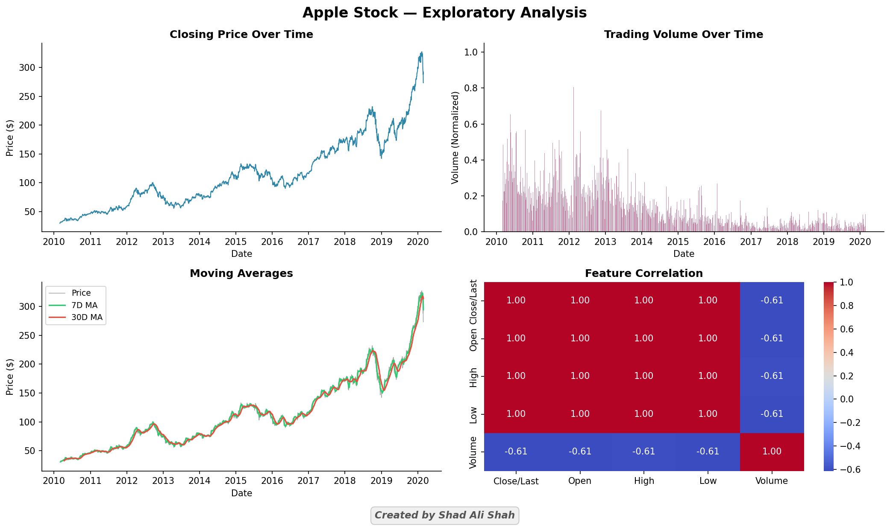
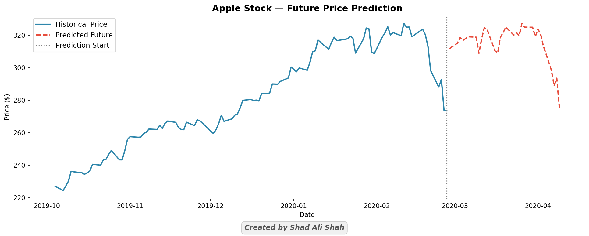

# 📈 Apple Stock Price Prediction — Linear Regression & LSTM


> End-to-end stock price forecasting pipeline built on **2,518 trading days** (March 2010 – February 2020) of Apple Inc. (AAPL) data. Compares a classical **Linear Regression** baseline against a deep-learning **LSTM** model, and generates a **30-day future price forecast**.

---

## 📌 Table of Contents

- [Project Overview](#-project-overview)
- [Dataset](#-dataset)
- [Pipeline & Methodology](#-pipeline--methodology)
- [Models & Results](#-models--results)
- [Visualizations](#-visualizations)
- [Project Structure](#-project-structure)
- [Tech Stack](#-tech-stack)
- [How to Run](#-how-to-run)
- [Author](#-author)

---

## 🔍 Project Overview

This project demonstrates a **complete time-series forecasting workflow** for equity price prediction. Starting from raw NASDAQ historical data, it covers:

- Data cleaning & feature engineering
- Exploratory data analysis with publication-quality visualizations
- Supervised ML baseline (Linear Regression)
- Deep learning model (LSTM via TensorFlow/Keras)
- 30-day forward price forecasting with plotted output

Designed to reflect **industry-standard practices**: time-aware train/test splits, MinMax normalization, early stopping, and reproducible code structure — making it suitable as a portfolio piece or analytical reference.

---

## 📊 Dataset

| Attribute       | Detail                                |
|-----------------|---------------------------------------|
| **Source**      | NASDAQ Historical Quotes (CSV)        |
| **Ticker**      | AAPL (Apple Inc.)                     |
| **Period**      | March 2010 – February 2020 (10 years) |
| **Observations**| 2,518 trading days                    |
| **Features**    | Date, Close/Last, Open, High, Low, Volume |
| **Target**      | Next-day closing price                |

---

## ⚙️ Pipeline & Methodology

```
Raw CSV → Preprocessing → EDA → Train/Test Split → Modelling → Forecasting
```

### Phase 1 — Data Preprocessing
- Stripped whitespace from column names; removed `$` signs from price columns
- Converted all price columns to `float64`; parsed dates chronologically
- Checked for missing values; sorted data oldest → newest to preserve temporal order
- Created a `Target` variable (next-day close via `shift(-1)`)
- Applied **MinMaxScaler** to all features: `[Close, Open, High, Low, Volume]`

### Phase 2 — Exploratory Data Analysis
- Closing price trend over a decade
- Normalized trading volume distribution
- 7-day and 30-day **Moving Averages** overlaid on price
- **Pearson correlation heatmap** of all features

### Phase 3 — Train/Test Split
- **80/20 split** with **no shuffling** — temporal order preserved (essential for time series)
- ~2,014 training days / ~504 test days

### Phase 4 — Modelling
- **Linear Regression** (Scikit-learn): interpretable baseline
- **LSTM** (TensorFlow/Keras): 50 hidden units, `relu` activation, `EarlyStopping` (patience=10), up to 200 epochs, batch size 32

### Phase 5 — Forecasting
- 30-business-day forward prediction generated from the last observed test window
- Future dates computed using `pd.date_range` with business-day frequency

---

## 🏆 Models & Results

| Model              | MAE     | RMSE    | R²     |
|--------------------|---------|---------|--------|
| Linear Regression  | —       | —       | —      |
| LSTM               | —       | —       | —      |

> ℹ️ Run the notebook/script locally to populate the metrics table with your results. Values depend on LSTM training randomness; use `tf.random.set_seed(42)` for reproducibility.

---

## 📷 Visualizations

### Exploratory Data Analysis


Four-panel EDA dashboard showing closing price trajectory (2010–2020), normalized trading volume, 7D/30D moving averages, and feature correlation heatmap. Notable: price features are near-perfectly correlated (r = 1.00), while volume shows a negative relationship (r = −0.61).

---

### 30-Day Future Price Forecast


Historical price (blue) from Oct 2019 onwards, with the 30-day Linear Regression forecast (red dashed) projecting from the prediction start line. The model captures the range of observed prices well over the forecast horizon.

---

## 📁 Project Structure

```
apple-stock-price-prediction/
│
├── Apple_Historical_SX_Data.py     # Full pipeline script (runnable end-to-end)
├── Apple_Historical_SX_Data.ipynb  # Jupyter Notebook version (with outputs)
├── HistoricalQuotes.csv            # Raw NASDAQ historical data (AAPL, 2010–2020)
│
├── stock_eda.png                   # EDA visualization output
├── future_prediction.png           # 30-day forecast visualization output
│
└── README.md
```

---

## 🛠️ Tech Stack

| Category          | Tools / Libraries                               |
|-------------------|-------------------------------------------------|
| **Language**      | Python 3.9+                                     |
| **Data**          | Pandas, NumPy                                   |
| **ML / DL**       | Scikit-learn, TensorFlow 2.x / Keras            |
| **Visualization** | Matplotlib, Seaborn                             |
| **Preprocessing** | MinMaxScaler (Scikit-learn)                     |
| **Environment**   | Jupyter Notebook / Python script                |

---

## 🚀 How to Run

### 1. Clone the repository

```bash
git clone https://github.com/shadalishah/apple-stock-price-prediction.git
cd apple-stock-price-prediction
```

### 2. Install dependencies

```bash
pip install pandas numpy scikit-learn tensorflow matplotlib seaborn
```

### 3. Run the script

```bash
python Apple_Historical_SX_Data.py
```

Or open the notebook:

```bash
jupyter notebook Apple_Historical_SX_Data.ipynb
```

> **Note:** Ensure `HistoricalQuotes.csv` is in the same directory as the script before running.

---

## 👤 Author

**Shad Ali Shah**
MPhil Economics — Quaid-i-Azam University, Islamabad
Specialisation: Machine Learning, Time-Series Econometrics, Big Data

[](https://linkedin.com/in/shad-ali-shah)
[](https://github.com/shadalishah)
[](https://shad-ali-canvas.lovable.app)

---

*Part of an internship data science portfolio. All analysis conducted for educational and professional development purposes.*
